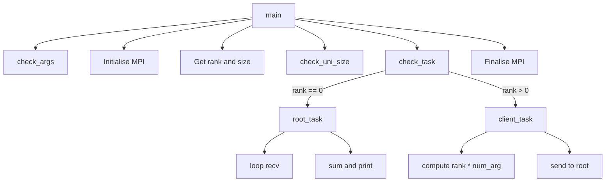

# Week 3 - Introduction to MPI

This exercise introduces MPI parallel programming. I started by comparing the parallel and serial versions of a hello world program to see the difference in how they run. Then I broke down the `proof.c` program to understand how MPI communication works. Finally I took the serial vector addition program and made a parallel version using MPI, then benchmarked them against each other.

## Running the code

All MPI programs need to be compiled with `mpicc` and run with `mpirun`:
```
mpicc hello_mpi.c -o ~/bin/hello_mpi
mpirun -np 4 ~/bin/hello_mpi
```

The serial programs just use `gcc`:
```
gcc hello_mpi_serial.c -o ~/bin/hello_mpi_serial
./bin/hello_mpi_serial
```

For the vector programs:
```
gcc vector_serial.c -o ~/bin/vector_serial
mpicc vector_parallel.c -o ~/bin/vector_parallel
./bin/vector_serial 100
mpirun -np 4 ~/bin/vector_parallel 100
```

Both should output `Sum: 4950` for an input of 100.

## Part 1 - Hello MPI

I ran `hello_mpi.c` (parallel) and `hello_mpi_serial.c` (serial) and compared the output and timing. The serial version prints each message in order and the `time` command shows user+sys is roughly equal to real time. With the parallel version the output is scrambled because each process prints independently without waiting for the others. The `time` output also changes, with user+sys exceeding real time at higher process counts. This is because `time` adds up CPU time across all cores but real time is just wall clock time, so if 4 processes each use 0.001s of CPU time the user time is 0.004s but real time is still around 0.001s.

## Part 2 - proof.c analysis

`proof.c` is an MPI program that takes a numerical argument, has each process multiply it by their rank, then the root process collects and sums all the results. Running it with 4 processes and an argument of 10 gives 60.

The program is split into several functions:

`main()` initialises MPI, gets the rank and universe size, then calls helper functions to validate the arguments, check the universe size, and dispatch the right task based on rank. It finalises MPI at the end.

`check_args()` makes sure exactly one numerical argument was provided and converts it to an integer with `atoi`. If the wrong number of arguments is given it prints an error and exits.

`check_uni_size()` checks that there are enough processes running (at least 1). If not it exits with an error.

`check_task()` looks at the rank and calls `root_task()` for rank 0 or `client_task()` for everything else.

`root_task()` loops through all the other ranks, receiving a message from each one with `MPI_Recv` and adding them to a running total which it prints at the end.

`client_task()` computes `my_rank * num_arg` and sends the result to root (rank 0) with `MPI_Send`.

The formula that gives the same result without MPI is `num_arg * n*(n-1)/2` where n is the universe size. For 4 processes and argument 10 that gives `10 * 4*3/2 = 60`.

The diagram below shows how the functions in proof.c connect together.



## Part 3 - Vector addition

I started with `vector_serial.c` from the lecturer's repo. The original has a TODO where the vector is supposed to be filled with values. I modified it so `my_vector[i] = i` which gives a sum equal to `n*(n-1)/2` for a vector of size n.

For the parallel version I combined the structure from `proof.c` with the vector logic from `vector_serial.c`. Each process creates the full vector, then works out its own chunk based on its rank and the universe size. It sums its chunk locally and either sends the partial sum to root (client processes) or receives and totals them all (root process). The last rank handles any leftover elements if the vector size doesn't divide evenly by the number of processes.

### Benchmarks

I tested with `time` to compare wall clock performance. Both versions give the same sum at every input size, confirming the parallel version is correct. The sum overflows `int` at large values but stays consistent across runs.

| N | Serial (real) | np=4 (real) | np=8 (real) | np=16 (real) |
|---|---|---|---|---|
| 1,000,000 | 0.006s | 0.594s | 0.800s | 1.249s |
| 100,000,000 | 0.421s | 0.906s | 1.129s | 1.540s |
| 500,000,000 | 2.044s | 2.048s | 2.482s | - |
| 1,000,000,000 | 3.986s | 3.348s | - | - |

At small input sizes the parallel version is much slower because of MPI startup overhead. The `mpirun` command needs to spawn processes, set up communicators, and establish connections between ranks before any computation happens. At 1 million elements the serial version finishes in 6 ms while the 4-process parallel version takes nearly 600 ms, with most of that being startup.

As the input size grows the actual computation starts to dominate over startup costs. At 500 million elements with 4 processes it is basically tied (2.048s vs 2.044s). At 1 billion elements the parallel version finally wins, finishing in 3.348s compared to 3.986s for serial.

The internal timing (measured inside the code, excluding MPI startup) tells a different story. At 1 billion elements the parallel computation itself only took 0.218s compared to the full 3.986s for serial. So the parallel computation is much faster but the overhead of `mpirun` eats into the advantage. For this kind of simple operation on a single machine, you need a very large input before parallelism actually pays off in wall clock time.
