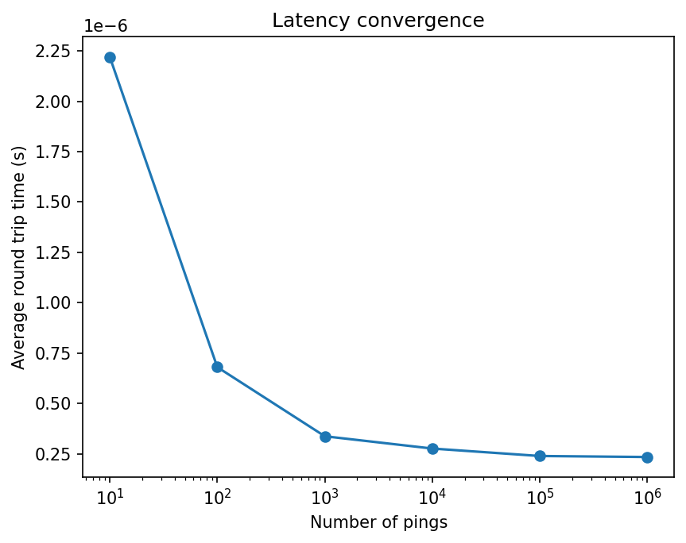
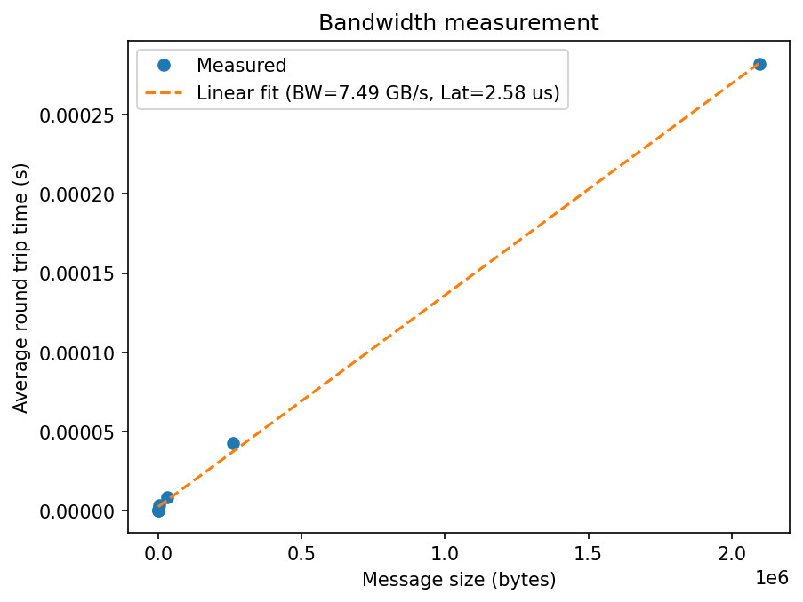

# Week 4 - MPI Communications

This exercise looks at different ways MPI can send and receive messages. I functionalised the `comm_test_mpi.c` program, tested the four different send types, then wrote a pingpong program to measure latency and bandwidth. I also modified the week 3 vector addition to use collective operations instead of manual send/recv loops.

## Running the code

Compile with `mpicc` and run with `mpirun` as usual:
```
mpicc comm_test_mpi.c -o ~/bin/comm_test_mpi
mpirun -np 4 ~/bin/comm_test_mpi
```

Pingpong needs exactly 2 processes:
```
mpirun -np 2 ~/bin/pingpong 10000
```

The bandwidth version takes two arguments, number of pings and array size in ints:
```
mpirun -np 2 ~/bin/pingpong_bw 10000 1024
```

## Part 1 - comm_test

Running the original `comm_test_mpi.c` with different process counts, the receives on root always come in order (1, 2, 3...) because root loops through ranks sequentially. But the send messages from clients print in random order since they all run at the same time. With np=1 it prints a warning.

I broke the code into functions following the proof.c pattern. Extracted `root_task`, `client_task`, `check_uni_size` and `check_task`, committing after each change.

### Send types

Made copies for each send variant and tested with np=4.

`MPI_Ssend` worked the same as normal send. It waits until the receiver has actually started receiving before it returns.

`MPI_Bsend` needs a buffer set up with `MPI_Buffer_attach` first. It copies the data into that buffer and returns straight away.

`MPI_Rsend` assumes the receive is already posted. On my machine it worked fine every time because everything is local and fast enough that root is always ready. On a real network this would probably fail sometimes.

`MPI_Isend` is non-blocking so it returns immediately. You need to call `MPI_Wait` afterwards or the data might not actually get sent before the program ends.

Out of all of them `MPI_Send` and `MPI_Ssend` are the most reliable. `MPI_Rsend` is the riskiest.

### Timing comm_test

Added `MPI_Wtime` around the send and receive calls. The times were in microseconds and very inconsistent between runs. The assignment predicted this and it makes sense since sending a single int locally is basically instant.

## Part 2 - Latency and bandwidth

### Latency

The pingpong program bounces a counter between root and client. Root sends (ping), client increments and sends back (pong). I timed the whole loop and divided by the number of pings.

| Pings | Total (s) | Average (s) |
|---|---|---|
| 10 | 0.000022 | 2.22e-06 |
| 100 | 0.000068 | 6.80e-07 |
| 1,000 | 0.000337 | 3.37e-07 |
| 10,000 | 0.002758 | 2.76e-07 |
| 100,000 | 0.023895 | 2.39e-07 |
| 1,000,000 | 0.234477 | 2.34e-07 |

It converges to about 0.23 microseconds per round trip. With fewer pings the average is higher because the loop startup overhead gets included.



### Bandwidth

Modified the program to send an array instead of a single int. Tested sizes from 8 bytes up to 2 MiB.

| Array (ints) | Bytes | Avg time (s) |
|---|---|---|
| 2 | 8 | 2.89e-07 |
| 16 | 64 | 3.25e-07 |
| 128 | 512 | 5.14e-07 |
| 1,024 | 4,096 | 3.72e-06 |
| 8,192 | 32,768 | 8.63e-06 |
| 65,536 | 262,144 | 4.27e-05 |
| 524,288 | 2,097,152 | 2.82e-04 |

For the linear fit y = mx + c, c is the latency (time for a zero-size message) and m is the inverse of bandwidth (extra time per byte). The fit gave a latency of about 2.58 microseconds and bandwidth of about 7.49 GB/s. The smallest messages (8 and 64 bytes) take about the same time as the latency-only test which shows that for tiny messages the data size barely matters.



## Part 3 - Collective communications

Took the week 3 vector addition and made versions using different collective operations. All tested at N = 100,000,000 with np=4.

| Version | What it does | Runtime (s) |
|---|---|---|
| DIY (original) | all processes build vector, send/recv loop | 0.0277 |
| Gather + loop | all processes build vector, Gather partial sums, root loops to sum | 0.0216 |
| Broadcast + Reduce | root builds vector, Bcast to all, Reduce | 0.3813 |
| Scatter + Reduce | root builds vector, Scatter chunks, Reduce | 0.0218 |
| Reduce only | all processes build vector, Reduce | 0.0277 |
| Custom Reduce | same but with MPI_Op_create | 0.0274 |

Broadcast was way slower because it sends the full 100M array to every process even though each one only needs its chunk. Scatter was fastest since each process only receives what it needs.

Gather and Scatter+Reduce came out at roughly the same speed (0.0216 vs 0.0218). Gather collects the partial sums into an array on root which then loops to add them up. Reduce does the summing as part of the collective call itself. For such a small amount of data (one int per process) the difference is negligible.

DIY and Reduce were basically the same speed because the bottleneck is every process building the full vector locally, not the communication step. Replacing the send/recv loop with a single Reduce call doesn't help much when the real work is in the vector creation and summation.

The custom reduce using `MPI_Op_create` gave the same answer as `MPI_SUM`. It was a tiny bit slower (0.0274 vs 0.0204) since the built-in version is optimised internally.
