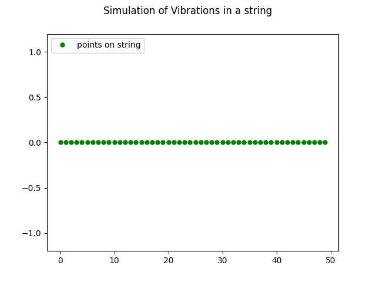
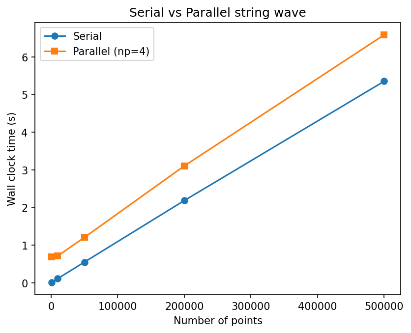
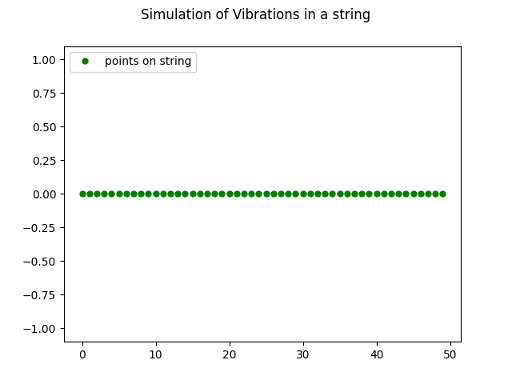

# Week 5 - Communicators and Topologies

This exercise is about simulating vibrations on a string. I started with the lecturer's serial program, removed the hard-coded values, then parallelised it with MPI. I also improved the physics model by adding a spring-mass system.

## Running the code

The serial version needs `-lm` to link the math library:
```
gcc string_wave.c -o ~/bin/string_wave -lm
./bin/string_wave 50 5 100 data/string_wave.csv
```

Arguments are points on the string, number of cycles, samples per cycle, and output file path.

The parallel version:
```
mpicc string_wave_parallel.c -o ~/bin/string_wave_parallel -lm
mpirun -np 4 ~/bin/string_wave_parallel 50 5 25 data/parallel_out.csv
```

The spring model:
```
gcc string_wave_spring.c -o ~/bin/string_wave_spring -lm
./bin/string_wave_spring 50 5 25 data/spring_out.csv
```

To generate an animation from any CSV output:
```
python3 animate_line_file.py data/string_wave.csv
python3 animate_line_file.py data/string_wave.csv data/custom_output.gif
```

The second argument is optional and sets where the gif gets saved.

## Part 1 - Serial code

The original `string_wave.c` simulates a vibrating string. The first point is driven by a sine wave and every other point just takes the previous value of the point before it. So the wave shifts one position to the right each timestep.

The program had cycles, samples, and the output path all hard-coded in main. I replaced these with command line arguments using a struct to return all four values from `check_args`. Added a null check on `fopen` too so the program gives a proper error if the output directory doesn't exist.

I also changed `animate_line_file.py` so you can pass in an output gif path as a second argument instead of it always saving to the default location.

## Part 2 - Parallel version

### Strategy

I split the string into chunks along its length, one chunk per process. Each rank only updates its own chunk each timestep. The tricky part is boundaries. Each rank's first point needs the old last value from the rank before it, so at every timestep each rank receives a boundary value from rank-1 and sends its last value to rank+1. Rank 0 doesn't receive from anyone since its first point is the driven end.

For getting the results together I used `MPI_Gatherv` to collect all chunks on root after every timestep. Root writes the full state to the CSV. I used Gatherv instead of Gather because when the number of points doesn't divide evenly the last rank ends up with a bigger chunk than the rest.

### Verification

Ran both serial and parallel with the same arguments and used `diff` on the output CSVs. No differences, so the parallel version gives the same results.



### Benchmarks

| Points | Serial (real) | np=4 (real) |
|---|---|---|
| 1,000 | 0.013s | 0.695s |
| 10,000 | 0.111s | 0.713s |
| 50,000 | 0.550s | 1.205s |
| 200,000 | 2.185s | 3.104s |
| 500,000 | 5.353s | 6.586s |



Parallel is slower at every size. The computation per point is trivial (just copying one value) so there's basically nothing to parallelise. The MPI_Gatherv runs every single timestep (126 times for 5 cycles at 25 samples) and has to collect the full array on root each time. That communication overhead eats any benefit from splitting the work.

This is not a task that benefits from parallelism. The bottleneck is communication not computation. With a more expensive update function it might start to pay off but for this simple model it doesn't.

## Part 3 - Spring model

The original model just copies values along which isn't realistic. I replaced it with a spring-mass model following the assignment suggestion of treating points as masses connected by springs with force f = -kx.

Each middle point has a force pulling it towards both its neighbors. The force on point i is `k * (positions[i-1] + positions[i+1] - 2 * positions[i])`. That gets divided by mass for acceleration, which updates velocity, which updates position. I added a damping factor (0.995 per step) to stop it blowing up.

The left end is driven by the sine wave. The right end is clamped at zero.



The result looks way more realistic. The wave has actual curvature and the amplitude drops off as it moves along the string because of the damping. The original just shifts dots to the right with no real physics.

I used k = 50, mass = 1, damping = 0.995. Found these by trial and error until it looked stable. The spring model needs more samples per cycle (100 instead of 25) because the smaller timestep keeps the simulation from blowing up.
